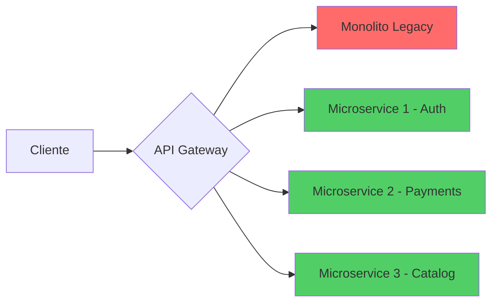

# Modernização de Sistemas Legados: O Guia Estratégico Completo

Sistemas legados são a **maior dívida técnica** das empresas brasileiras. Monolitos em Java 1.6, aplicações VB6, bancos de dados sem índices, zero testes automated... Sound familiar?

Em 2026, modernizar não é mais opcional. É **sobrevivência**.

<Callout type="warning">
**Realidade Brutal:** 82% das empresas brasileiras têm pelo menos 1 sistema crítico com mais de 10 anos. Desses, 65% rodam em infraestrutura on-premise sem redundância.
</Callout>

## Por Que Modernizar (Além do Óbvio)?

### 1. **Performance Catastrophic**

Sistemas legados normalmente sofrem de:
- ❌ Queries SQL N+1 (10.000+ queries por request)
- ❌ Falta de cache (tudo bate no banco)
- ❌ Sem CDN (assets pesados do servidor)
- ❌ Blocking I/O (1 thread = 1 request)

**Resultado:** Páginas que levam 8-15 segundos para carregar.

### 2. **Custo Operacional Proibitivo**

- 💰 Servidores físicos + data center próprio
- 💰 Equipe dedicada para manter infraestrutura
- 💰 Licenças de software proprietário
- 💰 Downtime constante (disponibilidade de 95% vs 99.99%)

<TwoColumnGrid>
  <Card title="Legacy On-Premise" icon="🐢">
    - Custo: R$ 45k/mês
    - Deploy: 2-4 semanas
    - Disponibilidade: 95%
    - Escalabilidade: Manual
  </Card>

  <Card title="Cloud-Native Modern" icon="🚀">
    - Custo: R$ 18k/mês
    - Deploy: 15 minutos (CI/CD)
    - Disponibilidade: 99.95%
    - Escalabilidade: Auto-scaling
  </Card>
</TwoColumnGrid>

### 3. **Impossibilidade de Inovar**

Quanto tempo leva para adicionar uma feature nova?
- **Legacy:** 3-6 meses (medo de quebrar tudo)
- **Moderno:** 1-2 sprints (testes + CI/CD)

---

## As 4 Estratégias de Modernização

Existem **4 caminhos** principais. A escolha depende de budget, urgência e risco:

### 1.  🔧 **Rehost (Lift & Shift)**

**O que é:** Mover o sistema "como está" para cloud (VMs).

**Prós:**
- ✅ Mais rápido (2-4 semanas)
- ✅ Menor risco técnico
- ✅ Redução de custo imediata (30-40%)

**Contras:**
- ⚠️ Não resolve dívida técnica
- ⚠️ Performance continua ruim
- ⚠️ Sem benefícios de cloud-native

**Quando usar:** Urgência extrema ou sistema que será descontinuado em 12-18 meses.

---

### 2. ⚙️ **Replatform (Lift, Tinker & Shift)**

**O que é:** Pequenas otimizações antes de migra para cloud.

**Prós:**
- ✅ Ganhos rápidos de performance (+40%)
- ✅ Modernização de infraestrutura (containers)
- ✅ Custo médio (6-12 semanas)

**Contras:**
- ⚠️ Arquitetura continua monolítica
- ⚠️ Dívida técnica parcialmente resolvida

**Quando usar:** Sistemas que precisam de melhorias mas não podem parar.

**Exemplo:**
```diff
# Antes: App rodando em Tomcat standalone
- java -jar app.war

# Depois: Dockerizado + Kubernetes
+ FROM openjdk:17-alpine
+ COPY target/app.jar /app.jar
+ ENTRYPOINT ["java", "-jar", "/app.jar"]
```

---

### 3. 🏗️ **Refactor (Microservices Migration)**

**O que é:** Quebrar monolito em microservices independentes.

**Prós:**
- ✅ Arquitetura escalável e resiliente
- ✅ Deploy independente de cada serviço
- ✅ Stack tecnológica heterogênea (Java + Node + Python)
- ✅ Performance otimizada (+200-300%)

**Contras:**
- ⚠️ Complexidade de orquestração (Kubernetes, service mesh)
- ⚠️ Custo alto (4-9 meses de desenvolvimento)
- ⚠️ Requer cultura DevOps madura

**Quando usar:** Sistemas críticos com expectativa de crescimento 5x+ nos próximos 3 anos.

#### Pattern: Strangler Fig

Migração **incremental** sem big bang:



**Estratégia:**
1. Crie API Gateway (Kong, AWS API Gateway, Traefik)
2. Implemente **1 microservice** por sprint
3. Redirecione tráfego gradualmente (10% → 50% → 100%)
4. Monitore erros e rollback se necessário
5. Deprecie módulo do monolito após 100% migrado

<Callout type="success">
**Case Real:** Uma fintech migrou monolito Rails de 500k linhas para 12 microservices em 8 meses. Resultado: latência p99 caiu de 3.2s para 180ms.
</Callout>

---

### 4. 🔥 **Rebuild (Greenfield)**

**O que é:** Reescrever do zero com stack moderna.

**Prós:**
- ✅ Zero dívida técnica
- ✅ Arquitetura otimizada desde o início
- ✅ Stack escolhida para o problema (não legacy)

**Contras:**
- ⚠️ Custo altíssimo (12-24 meses)
- ⚠️ Risco de perder features críticas
- ⚠️ Risco de "second system syndrome"

**Quando usar:** Sistema tão ruim que refatorar custa mais que rebuild.

<Callout type="warning">
**Atenção:** 68% dos projetos de rebuild falham por subestimar complexidade do sistema legado. Documente TUDO antes.
</Callout>

---

## Tecnologias Modernas para Substituir Legacy

### Backend

**Substituir:**
- ❌ Java 1.6/1.8 + EJB + JSP
- ❌ .NET Framework 4.x + WebForms
- ❌ PHP 5.x + CodeIgniter

**Por:**
- ✅ **Node.js + TypeScript** (Express, Fastify, NestJS)
- ✅ **.NET 8** (C# moderno + Minimal APIs)
- ✅ **Java 21** (Spring Boot 3, Virtual Threads)
- ✅ **Go** (performance crítica)
- ✅ **Python + FastAPI** (data + ML)

### Frontend

**Substituir:**
- ❌ jQuery + Bootstrap 3
- ❌ AngularJS 1.x
- ❌ GWT, Vaadin

**Por:**
- ✅ **React 18+** + Next.js (SSR/SSG)
- ✅ **Vue 3** + Nuxt
- ✅ **Angular 17+** (signals, standalone components)

### Database

**Substituir:**
- ❌ SQL Server 2008
- ❌ Oracle 11g
- ❌ MySQL 5.5

**Por:**
- ✅ **PostgreSQL 16+** (JSONB, full-text search, performance)
- ✅ **MongoDB** (documentos, escalabilidade horizontal)
- ✅ **Redis** (cache, session store)
- ✅ **Cloud-native DBs** (Aurora, CosmosDB, Cloud SQL)

### Infrastructure

**Substituir:**
- ❌ VMs on-premise
- ❌ Deploy manual via FTP
- ❌ Sem monitoramento

**Por:**
- ✅ **Containers** (Docker + Kubernetes)
- ✅ **CI/CD** (GitHub Actions, GitLab CI, Azure DevOps)
- ✅ **Observability** (Prometheus + Grafana + ELK)
- ✅ **IaC** (Terraform, Pulumi)

---

## Roadmap de Modernização (12 meses)

### Mês 1-2: Assessment & Discovery

```typescript
interface SystemAudit {
  codebase: {
    linesOfCode: number;
    complexity: number; // McCabe
    testCoverage: number;
    dependencies: DependencyReport;
  };
  performance: {
    avgResponseTime: number;
    p99ResponseTime: number;
    throughput: number;
    errorRate: number;
  };
  infrastructure: {
    servers: Server[];
    databases: Database[];
    integrations: Integration[];
  };
  businessCritical: {
    revenue: number; // R$/mês
    users: number;
    downtime: number; // horas/mês
  };
}

// Gera relatório de priorização
function prioritizeMigration(audit: SystemAudit): Priority {
  const riskScore = calculateRisk(audit);
  const impactScore = calculateBusinessImpact(audit);
  return { risk: riskScore, impact: impactScore };
}
```

### Mês 3-4: Arquitetura & POC

- Design de arquitetura target
- POC de 1 microservice
- Validação de performance
- Estimativa de custo cloud

### Mês 5-10: Migração Incremental

- Sprint 1-2: Infraestrutura base (k8s, CI/CD)
- Sprint 3-8: Migração de módulos (strangler pattern)
- Sprint 9-12: Integração e testes end-to-end

### Mês 11-12: Estabilização & Tuning

- Fine-tuning de performance
- Disaster recovery & backups
- Documentação completa
- Treinamento de equipe

---

## Evitando o Fracasso

<Callout type="error">
**Top 5 Motivos de Fracasso:**
1. 🚨 **Falta de buy-in executivo** (C-level não apoia)
2. 🚨 **Subestimar complexidade** (achismo vs realidade)
3. 🚨 **Big bang approach** (tentar mudar tudo de uma vez)
4. 🚨 **Zero automatização** (deploy manual, sem testes)
5. 🚨 **Ignorar cultura** (DevOps não é só ferramenta)
</Callout>

### Checklist de Sucesso

- ✅ Executive sponsor dedicado
- ✅ Equipe mista (legacy + modernização)
- ✅ Roadmap incremental (entrega a cada 2-4 semanas)
- ✅ Métricas claras de sucesso
- ✅ Budget realista (+30% de buffer)
- ✅ Plano de rollback para cada fase
- ✅ Documentação viva (não PDF morto)

---

## Conclusão: O Custo de Não Modernizar

Empresas que não modernizam pagam o preço:
- 💸 **Custo Operacional:** 40-60% maior
- 🐢 **Time to Market:** 5-10x mais lento
- 😫 **Developer Experience:** Turnover de 45%+
- 📉 **Competitividade:** Perda de mercado para concorrentes ágeis

**Modernização não é despesa. É investimento estratégico.**

---

**Tem um sistema legado tirando seu sono?** [Agende uma Auditoria de Código](/agendar) e mapeamos o melhor caminho de modernização para o seu contexto.
